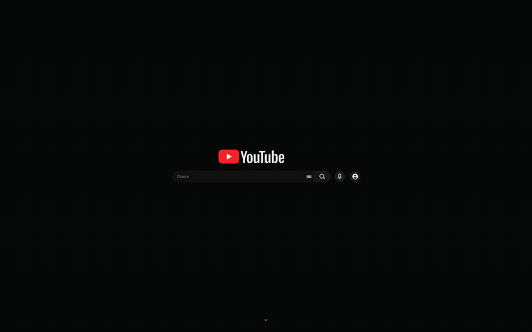

# Minimal for YouTube

Минималистичный YouTube: без ленты рекомендаций, Shorts и лишнего интерфейса —
остаются поиск, подписки и таймер сосредоточенной работы.

[English version](README.md)

## Как это выглядит



Полная запись в лучшем качестве: [docs/demo.mp4](docs/demo.mp4)

## Что делает

- **Нет ленты рекомендаций.** Главная перенаправляется на подписки, шапка там
  занимает весь экран, а лента начинается ниже сгиба.
- **Нет Shorts** — в подписках, в выдаче поиска, на каналах и во вкладке канала.
  Возвращаются тумблером в окне расширения.
- **Чистая страница видео.** Убраны колонка рекомендаций и рекламная врезка;
  без плейлиста плеер занимает всю ширину.
- **Переключение темы** — как на устройстве, светлая, тёмная. Работает через
  настройку самого YouTube, поэтому переживает перезагрузку.
- **Таймер сосредоточенной работы**: считает при закрытом окне, об окончании
  сообщает уведомлением и окном на странице.
- **15 языков интерфейса**, включая раскладку справа налево.

## Установка

### Из релиза

Скачайте архив для своего браузера в разделе
[Releases](https://github.com/KARIB9/minimal-for-youtube/releases) и распакуйте.

**Chrome** — `chrome://extensions` → Режим разработчика → Загрузить
распакованное расширение → выбрать папку.

**Firefox** — `about:debugging` → Этот Firefox → Загрузить временное
дополнение → выбрать `manifest.json`. Временное дополнение пропадает при
перезапуске браузера.

### Из исходников

```sh
git clone https://github.com/KARIB9/minimal-for-youtube.git
cd minimal-for-youtube
sh tools/build.sh
```

В `build/` появятся два архива, по одному на магазин. Различие только в
манифесте: у Chrome фоновый скрипт объявлен как `service_worker`, у Firefox как
`scripts`, и там же лежат id дополнения и минимальная версия браузера.

## Как устроено

| файл | за что отвечает |
|---|---|
| `early.js` | работает на `document_start`: перестраивает шапку, переносит настоящий логотип YouTube в центр, вставляет кнопки навигации |
| `content.js` | раскладка при переходах внутри SPA, переключение темы, окно таймера, самопроверка узлов YouTube |
| `styles.css` | все правила внешнего вида, сгруппированы по экранам |
| `timer.js` | фоновый отсчёт на `chrome.alarms` |
| `popup/` | окно расширения: тумблеры, выбор темы, таймер |
| `_locales/` | 15 языков |
| `tools/build.sh` | сборка архивов под магазины |

Две вещи, которые стоит знать, если полезете в код:

**Тему перекрашиваем не мы.** Новые компоненты YouTube покрашены жёстким
классом `…Dark`, который ставится в момент отрисовки, поэтому переключение
атрибута `dark` на `<html>` меняет только корневые токены, а сама страница
остаётся прежней. Расширение вместо этого просит YouTube сменить тему —
тем же действием, что стоит за пунктом «Тема» в меню аккаунта.

**Скрытие одиночной карточки Shorts требует `:has()`.** Карточка опознаётся по
вложенной ссылке `/shorts/`, а добраться от неё до контейнера умеет только
`:has()`. В Firefox он работает с 121-й версии; на 109–120 полки скрываются,
а отдельные карточки остаются.

## Совместимость

Chrome и браузеры на Chromium, Firefox 109+ (для полного скрытия Shorts — 121+).
Из разрешений только `storage`, `alarms` и `notifications`; ничего не собирается
и никуда не отправляется.

## Поддержать

Если расширение оказалось полезным: [Boosty](https://boosty.to/batton_rooge/donate)
· [Ko-fi](https://ko-fi.com/batton_rouge)

## Лицензия

[MIT](LICENSE)
